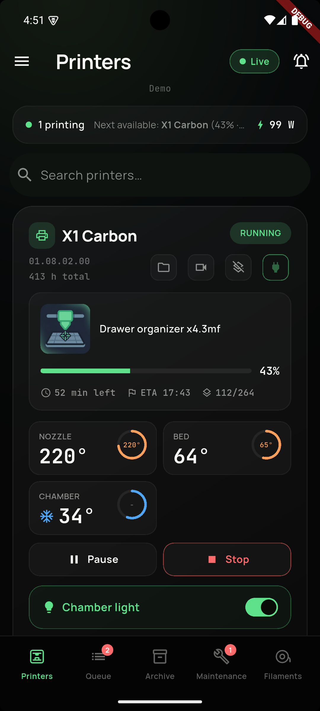
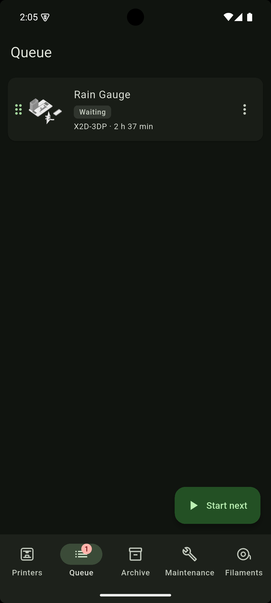
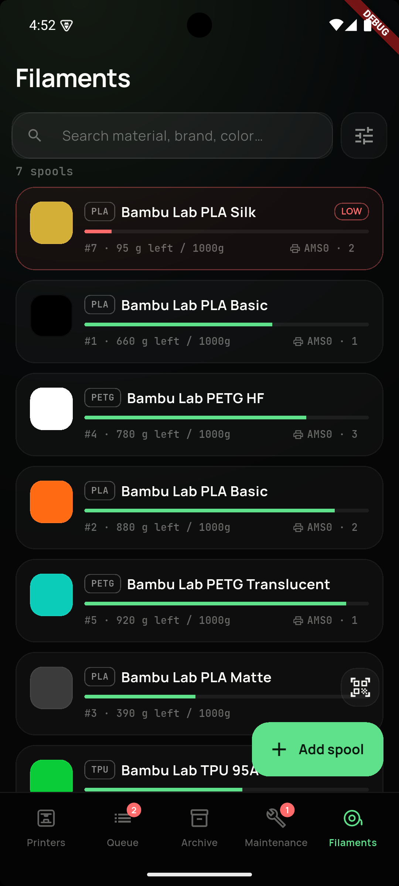
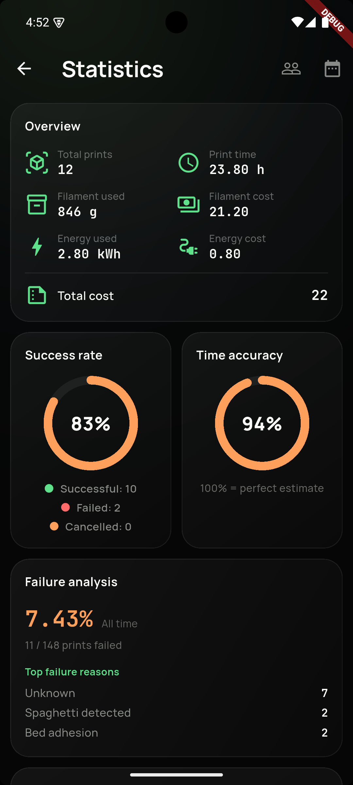
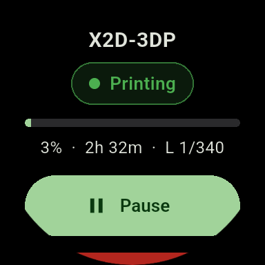
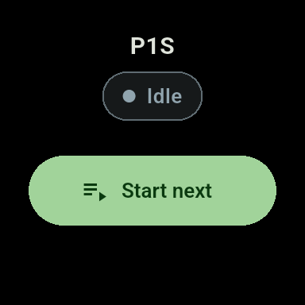

# Bambuddy mobile

An unofficial, open-source mobile app (Flutter, Android + Wear OS) for [bambuddy](https://github.com/maziggy/bambuddy) — a self-hosted, cloud-free manager for Bambu Lab 3D printers.

> **This is NOT an official Bambu Lab app** and is not affiliated with or endorsed by Bambu Lab. "Bambu Lab" and "Bambu" are trademarks of their respective owner.
>
> **It requires your own running bambuddy server.** The app does not connect to Bambu Lab cloud on its own — without a server to point it at, it won't work.

## The bambuddy server

This app is a companion to the bambuddy server — get and set it up here first:

- **Source & install:** https://github.com/maziggy/bambuddy
- **Website:** https://bambuddy.cool
- **Documentation / wiki:** https://wiki.bambuddy.cool
- **Live demo:** https://demo.bambuddy.cool

## Distribution

- **[Google Play](https://play.google.com/store/apps/details?id=page.codeberg.morganmlgman.bambuddy_mobile)** *(testing — early access)*
- **Codeberg Releases** (for [Obtainium](https://github.com/ImranR98/Obtainium)) — [repository releases](https://codeberg.org/DoYouHost/bambuddy-mobile/releases); phone and watch ship as separate APKs (`app-mobile` / `app-wear`) in one release
- **Project page:** https://doyouhost.codeberg.page/bambuddy-mobile/
- **Privacy policy:** https://doyouhost.codeberg.page/bambuddy-mobile/privacy.html ([source](docs/privacy-policy.md))

Phone and watch share one `applicationId` (a single Play listing) and differ only by flavor (`mobile` / `wear`).

## Demo user

Point the app at the magic `demo` server and sign in with the credentials below to explore without your own bambuddy server.

| Field    | Value      |
| -------- | ---------- |
| URL      | `demo`     |
| User     | `demo`     |
| Password | `demo1234` |

## Features

**Monitor**
- Live printer status: state, progress, layer, ETA and temperatures (WebSocket + REST polling)
- Persistent print-progress notification via a foreground service, even when the app is in the background
- Configurable alerts for print events and hardware (HMS) errors

**Control**
- Pause, resume and stop prints
- Clear the plate and start the next job in the queue
- Manage the queue (reordering, AMS mapping) and slice files via the server's slicer

**Filament & hardware**
- Track your spool inventory and assign spools to AMS slots
- Scan spool QR codes with the camera
- Smart-plug control and power monitoring
- Maintenance tracker with reminders

**More**
- Print archive and statistics, projects (plates/parts), MakerWorld import
- Home-screen widget (status + a quick spool-scan shortcut)
- **Wear OS** companion: check status and control prints from your watch (relay through the phone + REST fallback)
- Demo mode (the magic `demo` server) to explore without your own server

## Screenshots

<p align="center">
  
  
  
  
</p>

Wear OS:

<p align="center">
  
  
  
</p>

More in [docs/store-assets/screenshots](docs/store-assets/screenshots) (phone, 7"/10" tablet, Wear OS).

## Privacy

The app talks **only** to the bambuddy server you configure. There is no analytics, no advertising and no cloud service. Credentials are stored in encrypted, Android Keystore-backed storage (`flutter_secure_storage`) and are only ever sent to your own server.

## Authentication

Three modes, detected automatically (`GET /api/v1/auth/status`): disabled / username+password (JWT) / API key (`X-API-Key`). **API keys are recommended** — they don't expire and are scoped.

## Server compatibility

Built and tested against **bambuddy** with the `/api/v1` API. The server API is young and moves fast — newer versions should work but without guarantees; parsing is defensive (unknown fields are ignored, missing ones don't crash the app).

## Build

Requires [Flutter](https://docs.flutter.dev/get-started/install) (stable) and the Android SDK.

```sh
flutter pub get
dart run build_runner build --delete-conflicting-outputs
flutter run --flavor mobile                 # phone on a connected device
```

Release builds and releases go through [`just`](https://github.com/casey/just) (see [justfile](justfile)):

```sh
just build            # phone release APK (mobile flavor) -> build/dist/
just build-wear       # watch release APK (wear flavor)   -> build/dist/
just build-aab        # AABs for both flavors for Google Play -> build/dist/
just ship X.Y.Z       # full pipeline: bump + test + build + Codeberg release
```

Tests and lint:

```sh
flutter analyze
flutter test
```

## License

[AGPL-3.0](LICENSE) — consistent with bambuddy. The app contains no code from other projects; it is architecturally inspired by, among others, [Mobileraker](https://github.com/Clon1998/mobileraker) and [BamPocket](https://github.com/clabeuhtegrite/bambuddy-pocket).
